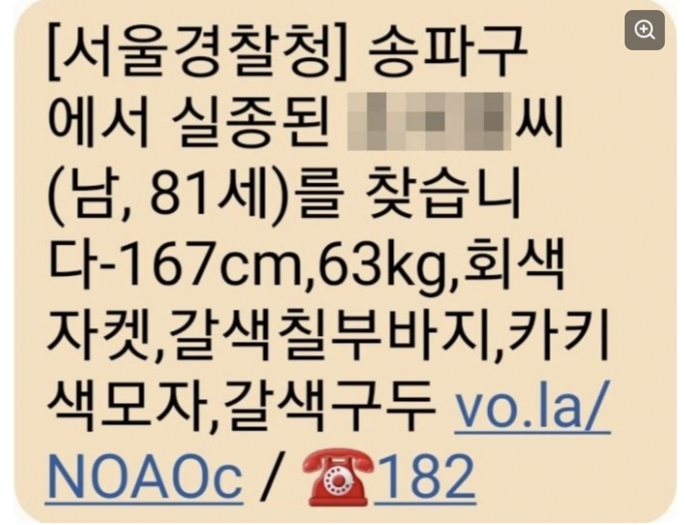
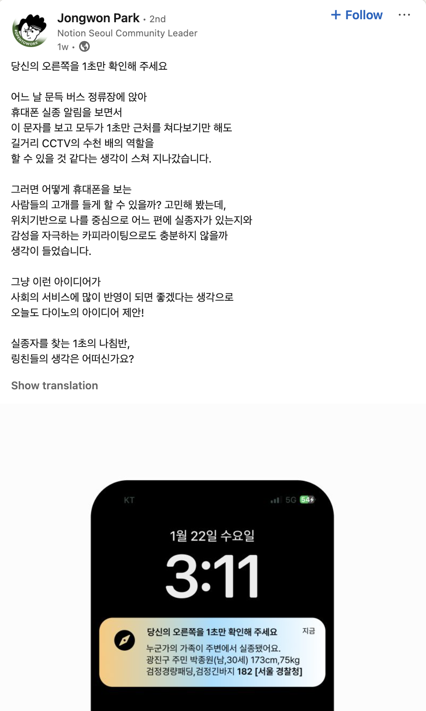

# Look Around
> "잠깐, 주변을 한번 둘러봐주세요".

**한국인 대부분이라면 한 번쯤은 경보 문자를 받아보셨을 겁니다.** 문자가 너무 많이 와서 불편함을 느낄 때도 있지만, 종종 어린 나이에 실종되는 경우를 볼 때면, 찾고 있을 가족들 생각에 안타깝기도 합니다.




과거 실종자 링크를 클릭해보았더니, `네이버 블로그`가 나왔습니다. 전국민들에게 실종 문자를 보내는 것 치고는 개선의 여지가 있다는 생각이 들었습니다. "나라면 뭘 개선할 수 있을까?" 시민들이 이동 중일 때, **근처에 실종 신고된 사람**이 있다면 **앱 푸시 알림**으로 알려주고, **신상정보를 토대로 주변을 살펴볼 수 있도록** 만들면 매우 효율적일 것이라는 생각이 들었습니다. 한편으로는 "만들면 누가 쓸려나..? 서버비는 어떻게 하지..? 앱은 어떻게 만들지..?"라는 고민에 다시 일상으로 돌아갔습니다.


그러던 어느 날, 링크드인에서 비슷한 방향성의 고민을 하는 [종원님의 글](https://www.linkedin.com/posts/jongwon-park-41a170177_%EB%8B%B9%EC%8B%A0%EC%9D%98-%EC%98%A4%EB%A5%B8%EC%AA%BD%EC%9D%84-1%EC%B4%88%EB%A7%8C-%ED%99%95%EC%9D%B8%ED%95%B4-%EC%A3%BC%EC%84%B8%EC%9A%94-%EC%96%B4%EB%8A%90-%EB%82%A0-%EB%AC%B8%EB%93%9D-%EB%B2%84%EC%8A%A4-%EC%A0%95%EB%A5%98%EC%9E%A5%EC%97%90-%EC%95%89%EC%95%84-activity-7287727556953284608-mbE3/?originalSubdomain=kr)을 접하면서, "누군가도 나와 같이 어떻게 개선할 수 있을지 고민하고 있구나"라는 생각에 동기부여를 받았습니다. 마침 설날이 다가오기도 하여, 앱 개발자이신 강민님과 함께 빠르게 MVP를 제작하게 되었고, 이제 피드백을 받아보려고 합니다.



`Look Around` 앱은 사용자가 이동하는 동안, 주변에 신고된 실종자가 존재하면 이를 알려줍니다. 이 알림을 받은 사용자는 제공된 실종자 신상정보를 토대로 잠시 주변을 둘러보며 상황을 확인할 수 있도록 설계되었습니다. 

**만약 LookAround의 이 아이디어에 공감을 하신다면, 사용해보시고 피드백 주신다면 감사하겠습니다.**


## Worker Design
> https://github.com/missingfinder/missingfinder

이 프로젝트는 실종자 데이터를 수집, 저장 및 조회하는 Cloudflare Workers 기반의 서비스입니다. 

- [[자료 출처: 경찰청]](https://www.safe182.go.kr/home/api/guide5.do)
- Note: Bearer token이 없을 경우, 사용불가합니다.
- 매일 03:00AM(UTC 18:00)에 DB가 refresh됩니다. (Currently lack of lock mechanism)

## 1. 실종자 데이터 저장 및 갱신 Worker

> https://missingproxy.missingfinder-kr.workers.dev

### 작동 방식


1. 경찰청 OpenAPI에서 실종자 데이터를 페이지네이션을 이용해 수집합니다.  
   - **제약사항:** 하루 1000건의 요청 제한이 있으며, 데이터 갱신 여부를 알 수 있는 API가 제공되지 않습니다.
2. D1 데이터베이스에서 현재 저장된 실종자 데이터를 가져옵니다.
3. 데이터 비교를 통해 다음과 같이 처리합니다.  
   - **새로운 데이터 (NewRows)**: API에서 새롭게 발견된 데이터  
   - **삭제할 데이터 (DeleteRows)**: API에서 더 이상 제공되지 않는 데이터  
   - **갱신할 데이터**: 기존 데이터와 비교하여 변경이 감지된 경우 삭제 후 삽입
   - 데이터 변경 여부를 판단하기 위해 `data_hash` 값을 사용합니다.
4. 새로운 데이터는 주소 정보만 포함되어 있으므로, Kakao API를 이용하여 x, y 좌표를 가져옵니다.
   - 좌표 조회 실패 시 기본값으로 청와대 좌표(126.9764, 37.5867)를 사용합니다.
5. 데이터베이스 업데이트를 수행합니다.
   - **제약사항:** Cloudflare D1의 **최대 SQL 문장 크기 제한(100KB)**을 고려하여 **BATCH_SIZE = 3**으로 설정하여 데이터를 삽입합니다.

### 초기화 과정 (Init)

초기 실행 시 300~500명의 실종자 데이터가 존재할 수 있으며, Cloudflare Free Tier의 **subrequest 제한 (최대 50 요청/Request)**으로 인해 Cloudflare 내부에서 모든 데이터를 처리할 수 없습니다.  
따라서 **local에서 `init.js`를 사용하여 SQL 쿼리를 생성한 후, 배치 단위로 업로드해야 합니다.**

```bash
for file in insert_missing_persons_*.sql; do
    yes | wrangler d1 execute missing_db --remote --file="$file"
done
```

## 2. 실종자 위치 기반 조회 Worker
> https://geo-missing-lookup.missingfinder-kr.workers.dev

### 작동 방식
1.	사용자가 x, y 좌표를 입력합니다.
2.	D1 데이터베이스에서 Haversine 공식을 이용하여 반경 내에 포함된 실종자 데이터를 검색합니다.
3.	최대 반환할 인원 수(max_people)를 기준으로 정렬하여 데이터를 반환합니다.


```js
const x = parseFloat(url.searchParams.get("x"));
const y = parseFloat(url.searchParams.get("y"));
const max_people = parseInt(url.searchParams.get("max_people")) || 10;
const threshold_km = parseFloat(url.searchParams.get("threshold_km")) || 5;
```


<script type="text/javascript" async
  src="https://cdnjs.cloudflare.com/ajax/libs/mathjax/2.7.7/MathJax.js?config=TeX-MML-AM_CHTML">
</script>

<script type="text/x-mathjax-config">
MathJax.Hub.Config({
  tex2jax: {
    inlineMath: [['$','$'], ['\\(','\\)']],
    displayMath: [['$$','$$'], ['\\[','\\]']],
    processEscapes: true
  }
});
</script>

## Haversine 공식 (구면 코사인 법칙)

두 좌표 $({\phi_1}, {\lambda_1})$와 $({\phi_2}, {\lambda_2})$ 사이의 거리를 계산하는 공식은 다음과 같습니다.

$$
d = R \cdot \cos^{-1} \left( \sin \phi_1 \sin \phi_2 + \cos \phi_1 \cos \phi_2 \cos (\lambda_2 - \lambda_1) \right)
$$

변수 설명:
- $d$: 두 지점 간 거리 (km)
- $R$: 지구 반지름 (약 6371 km)
- $\phi_1, \phi_2$: 위도 (radian)
- $\lambda_1, \lambda_2$: 경도 (radian)

### SQL 쿼리 (Haversine 공식 적용)

```sql
SELECT id, name, current_age, age_when_missing, incident_date, clothing_description, 
       person_type, gender, incident_location, incident_x, incident_y, additional_features, 
       photo_base64,
       (6371 * ACOS(
            COS(RADIANS(?)) * COS(RADIANS(incident_y)) * COS(RADIANS(incident_x) - RADIANS(?)) + 
            SIN(RADIANS(?)) * SIN(RADIANS(incident_y))
       )) AS distance
FROM missing_persons
WHERE (
    6371 * ACOS(
        COS(RADIANS(?)) * COS(RADIANS(incident_y)) * COS(RADIANS(incident_x) - RADIANS(?)) + 
        SIN(RADIANS(?)) * SIN(RADIANS(incident_y))
    )
) <= ?
ORDER BY distance ASC
LIMIT ?;
```

위 SQL 쿼리는 주어진 $(x, y)$ 좌표를 기준으로 특정 반경 내(threshold_km)에 위치한 실종자들을 검색하며, 가장 가까운 순으로 정렬하여 최대 max_people명의 데이터를 반환합니다.
